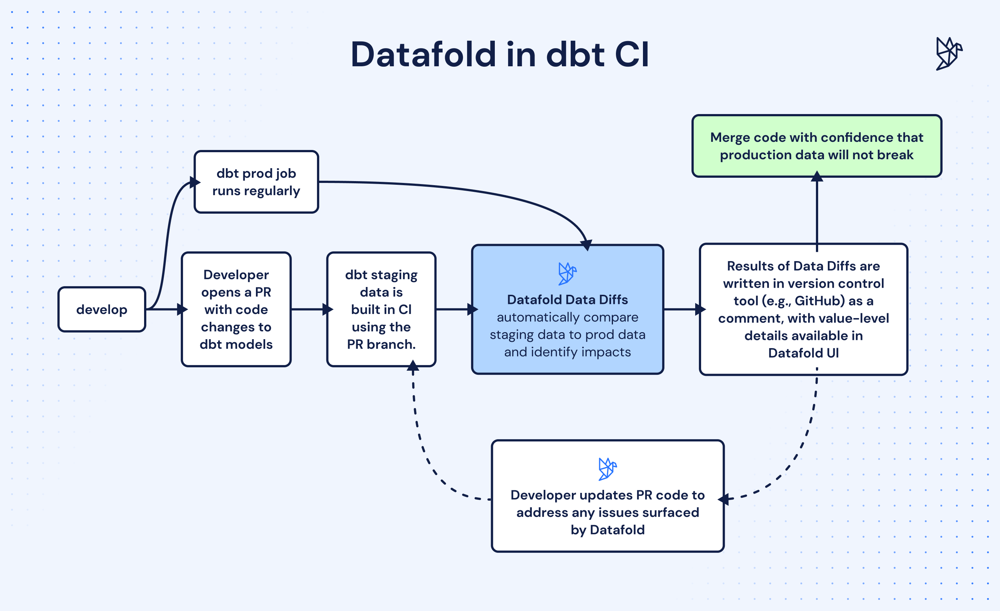

# vhol-demo

This is a demo repo to show how easy it is to get setup with dbt continuous integration and deployment using GitHub Actions.
You should be able to run this self-contained example, use the `yml` workflow files as template, make some minor changes and have your own dbt project up and running with CI/CD in no time.



**Tech Stack:**

- dbt Core
- Snowflake
- GitHub Actions
- Datafold Cloud
- AWS S3

If you have questions unique to your tech stack, schedule a call with us at: [Datafold](https://www.datafold.com/)

## What does success look like?

- Slim CI pipeline that runs and tests only the models that have changed and their downstream models in your pull requests
- Automated Datafold data diffs in your pull requests if you have a Datafold account
- Automated deployment of changed dbt models to production and their downstream models when pull requests merge into the main production branch
- Automated staging schema cleanup after a pull request is closed so you don't have schema clutter

## Getting Started

> This guide is self-contained and can run from scratch. Once you get the hang of it, you can repeat the steps for your own dbt project.

1. Search the entire repo for `TODO` and replace with your own values
2. Setup your S3 bucket for Slim CI: [Video Tutorial]()

```bash
# upload your production manifest file to your S3 bucket
dbt ls --target prod
```
<details>
  <summary>AWS IAM Policy Code Snippet</summary>
  
  ```json
  {
    "Version": "2012-10-17",
    "Statement": [
        {
            "Sid": "ListObjectsInBucket",
            "Effect": "Allow",
            "Action": ["s3:ListBucket"],
            "Resource": ["arn:aws:s3:::vhol-datafold-dbt-prod-manifest"] # TODO: replace with your own bucket name
        },
        {
            "Sid": "AllObjectActions",
            "Effect": "Allow",
            "Action": "s3:*Object",
            "Resource": ["arn:aws:s3:::vhol-datafold-dbt-prod-manifest/*"] # TODO: replace with your own bucket name
        }
    ]
}
  ```
  
</details>

3. Set up your GitHub secrets
4. Commit your changes and push to your remote repository
5. Run the below to build your dbt project on the `main` branch

```bash 
dbt build --target prod
```

6. Run the below to switch branches and test your CI pipelines

```bash
git checkout -b feature/your-feature
```

7. Make some changes to your dbt models and push to your remote repository. You can copy and paste the examples here and run it locally: [example_dbt_changes](example_dbt_changes/)

```bash
dbt build
```

8. See your CI pipeline run and test your changes in your pull request

9. Merge the pull request and watch as your changes are deployed to production and your staging schema is cleaned up
